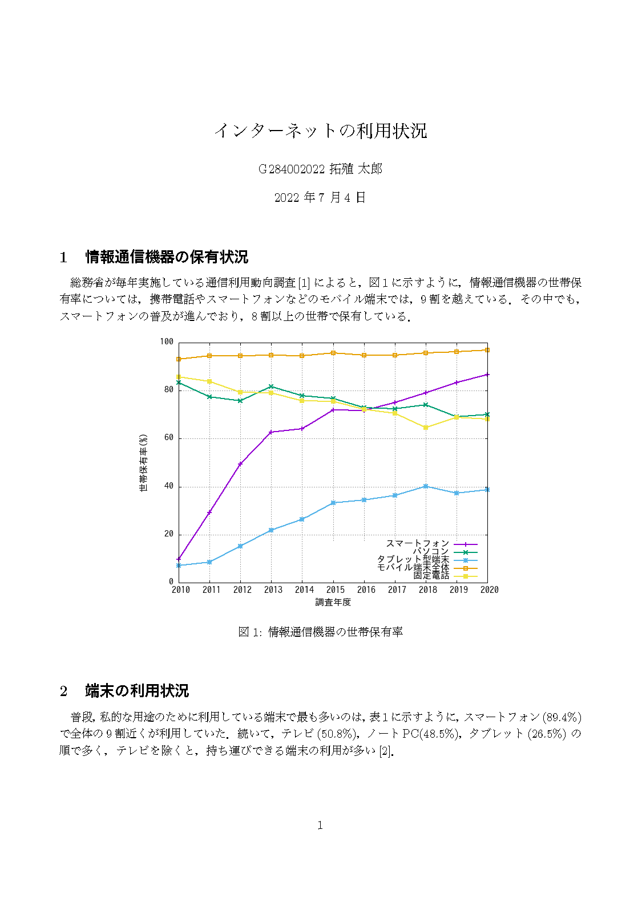
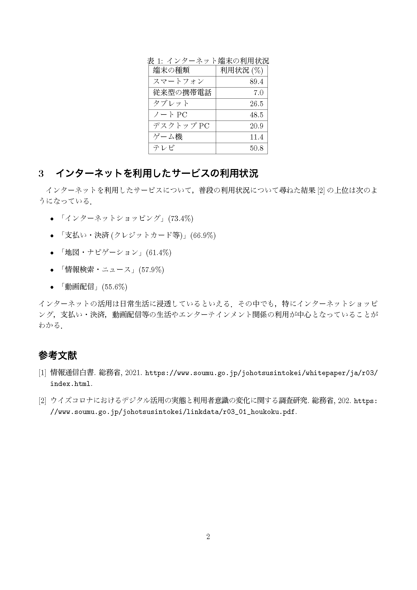

# LaTeX

次のような2ページのPDF出力が得られるように，
`exercise.tex` の内容を修正し，提出せよ．
**学生番号と氏名は自分のものにすること**

文献データベース `exercise.bib` のキーワードは `soumu` と `corona` になっている．

なお，挿入しているグラフは，gnuplot を利用して，
`gt050103.csv`のデータから生成している．
生成に使った gnuplot のコマンドは `possession.gp` に
記述しているので，前回の復習として参考にして欲しい，

